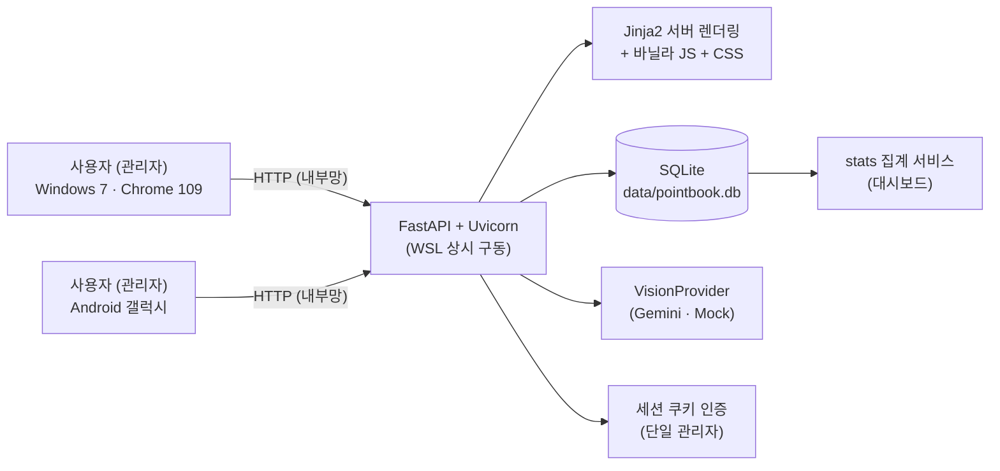
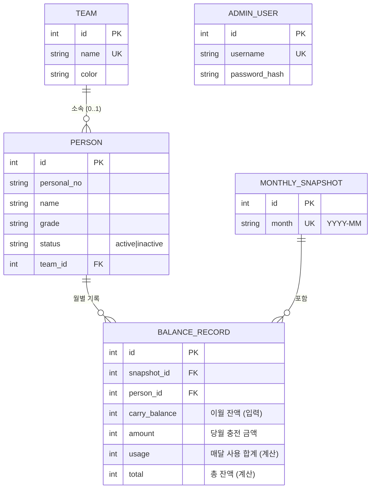
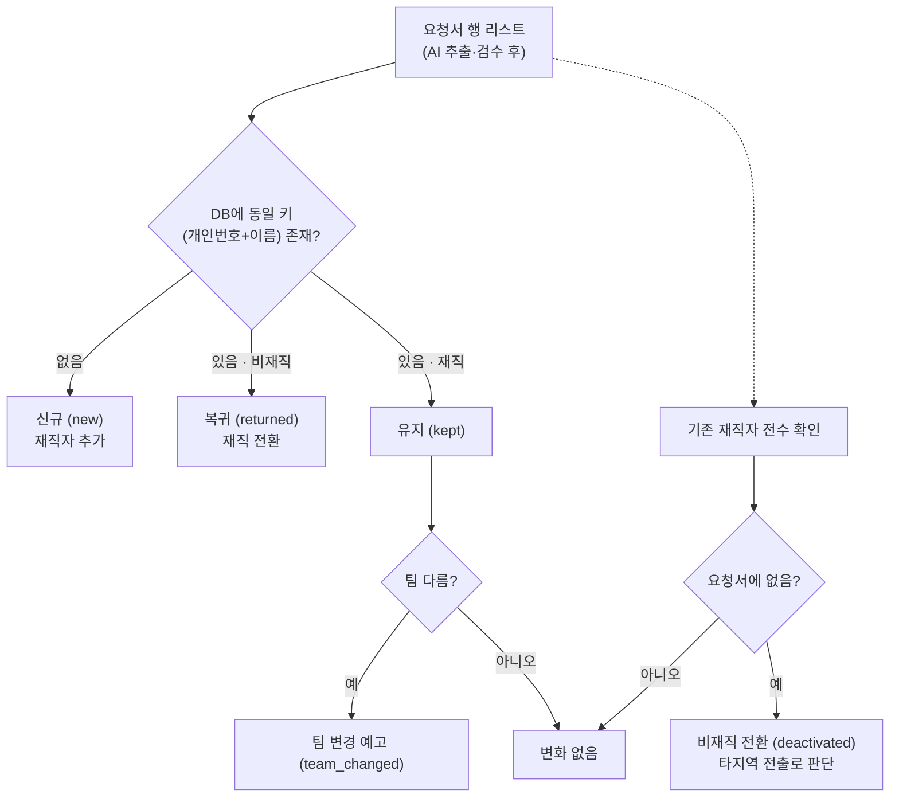
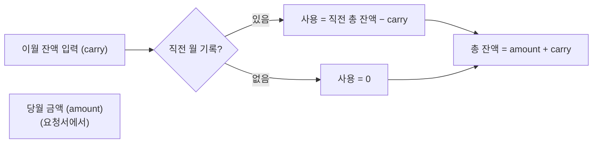
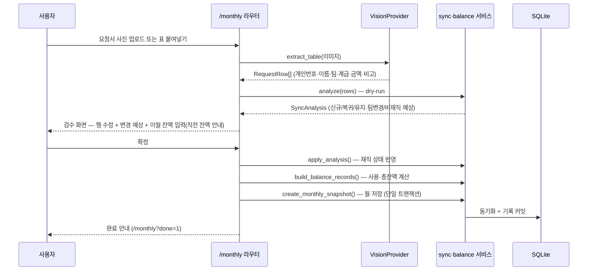
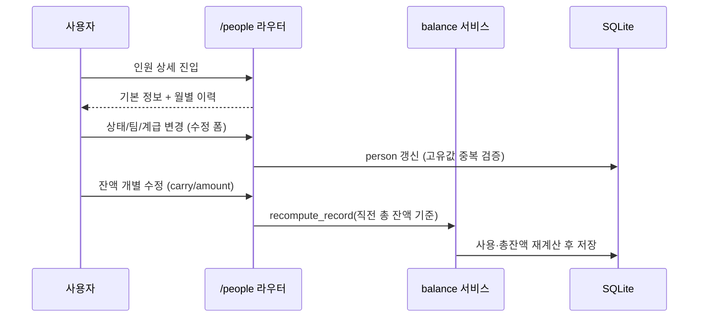
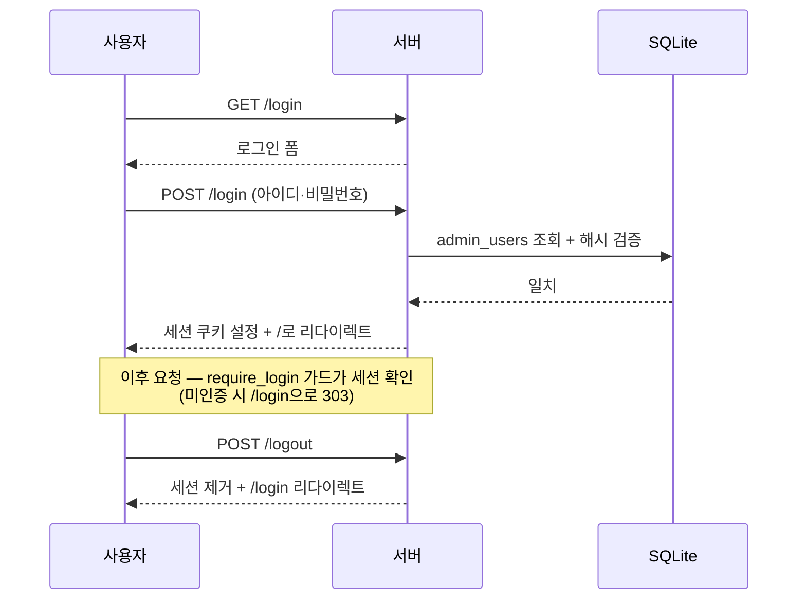
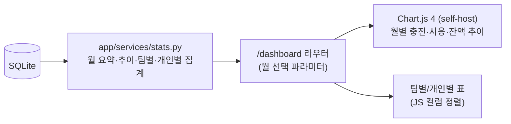
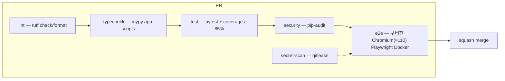

# PointBook 아키텍처

소방서 포인트 충전 요청서(엑셀)를 웹에서 관리하는 서비스의 기술 아키텍처 문서.
코드 구조, 데이터 모델, 핵심 도메인 로직, 주요 흐름을 다이어그램과 함께 설명한다.

## 1. 시스템 개요



- **클라이언트**: 빌드 단계 없는 서버 렌더링 HTML + 바닐라 JS — Win7 Chrome 109·갤럭시 호환
- **서버**: FastAPI + Uvicorn, WSL 환경에서 백그라운드 구동 (`scripts/run.sh`)
- **저장소**: SQLite 단일 파일 — 백업·이관이 파일 복사로 끝남
- **AI**: `VisionProvider` 인터페이스로 추상화 — Gemini 구현체 제공, 프로바이더 교체는 `AI_PROVIDER` 설정만 변경
- **캐시**: 모든 HTML 응답에 `Cache-Control: no-store` 미들웨어 적용 (스테일 페이지 방지, 정적 파일은 캐시 유지)

## 2. 디렉터리 구조

```
PointBook/
├── app/
│   ├── main.py             # FastAPI 앱 생성, 라우터 등록, lifespan(DB 초기화)
│   ├── config.py           # 환경설정 (pydantic-settings, .env)
│   ├── db.py               # SQLAlchemy 엔진·세션, configure_database, init_db
│   ├── models.py           # ORM 모델 5종 (아래 ERD)
│   ├── auth.py             # 세션 인증 — require_login 가드
│   ├── template_utils.py   # Jinja2 템플릿 객체 + number_format 필터
│   ├── routers/            # 라우터 (URL → 렌더링/리다이렉트)
│   │   ├── auth.py         #   로그인/로그아웃
│   │   ├── home.py         #   홈 (카드 메뉴)
│   │   ├── people.py       #   인원 목록·추가·수정·상세·개별 잔액 수정
│   │   ├── teams.py        #   팀 마스터 추가/삭제 + 팀 상세(소속 인원)
│   │   ├── monthly.py      #   월간 처리: 업로드 → 검수 → 확정
│   │   └── dashboard.py    #   대시보드 (월 선택)
│   ├── services/           # 도메인 로직 (라우터에서 호출)
│   │   ├── sync.py         #   ★ 재직 상태 대조 동기화 (analyze/apply)
│   │   ├── balance.py      #   ★ 잔액 계산 (사용 합계·총 잔액·스냅샷)
│   │   ├── stats.py        #   대시보드 집계 (월/팀/개인/추이)
│   │   ├── teams.py        #   팀 자동 생성 (get_or_create_team)
│   │   ├── parsing.py      #   붙여넣기 텍스트 파싱
│   │   ├── excel_import.py #   엑셀 이관 (openpyxl)
│   │   └── dates.py        #   KST 시간대 current_month
│   ├── ai/                 # 요청서 사진 인식
│   │   ├── base.py         #   VisionProvider 인터페이스
│   │   ├── gemini.py       #   Gemini 구현체 (REST, GEMINI_MODEL)
│   │   ├── mock.py         #   Mock 구현체 (MOCK_TABLE_JSON)
│   │   └── factory.py      #   AI_PROVIDER 설정으로 선택 (mock|gemini)
│   ├── templates/          # Jinja2 템플릿 (base/people/teams/monthly/review/...)
│   └── static/             # css/style.css, js/(dashboard.js, chart.umd.min.js), fonts/
├── scripts/
│   ├── init_db.py          # 테이블 생성 + 관리자 계정 생성
│   ├── import_excel.py     # 기존 엑셀 → DB 이관 (빈 DB 전용)
│   ├── run.sh              # WSL 상시 구동 (백그라운드, PID/로그)
│   └── stop.sh             # 서버 중지
├── tests/                  # pytest 단위 테스트 (커버리지 85%+)
├── e2e/                    # 구버전 Chromium(≈Chrome 110) Playwright E2E (Docker)
├── docs/                   # 아키텍처·사용 가이드
└── .github/workflows/ci.yml# CI (lint/typecheck/test/security/secret-scan/e2e)
```

레이어 규칙: `routers → services → models/db`. 라우터는 폼 파싱·렌더링만 담당하고,
도메인 규칙은 반드시 services에 둔다 (테스트 가능성·재사용 보장).

## 3. 데이터 모델 (ERD)



| 테이블 | 설명 |
|---|---|
| `teams` | 팀 마스터. 요청서에서 새 팀이 나오면 자동 생성, 이름·색상 관리 |
| `people` | 인원. **고유값 = (personal_no, name)**. 삭제 없음 — 비재직은 `status=inactive` |
| `monthly_snapshots` | 월간 처리 단위. `month`(YYYY-MM) 중복 불가 |
| `balance_records` | 인원×월별 잔액 기록. `(snapshot_id, person_id)` 유일 |
| `admin_users` | 관리자 계정 (werkzeug 해시) |

## 4. 핵심 도메인 로직

### 4-1. 재직 상태 대조 동기화 (`app/services/sync.py`)

요청서는 "이번 달 충전 대상 명단"이므로, **DB의 전체 인원과 대조**해야 한다.



- `analyze(db, rows) → SyncAnalysis`: **DB를 변경하지 않고** 변경 계획만 계산 (검수 화면의 예상 표시용, dry-run)
- `apply_analysis(db, analysis)`: 계획을 실제 반영 (신규 추가·비재직 전환·복귀·팀 변경 — 새 팀은 마스터에 자동 생성)
- 중복 행(동일 키)은 1건으로 처리, `request_count`는 요청서 인원 수

### 4-2. 잔액 계산 (`app/services/balance.py`)

매달 요청서 수령 시 **처리 대상 전체 인원**의 이월 잔액을 사용자가 입력한다.

| 항목 | 공식 |
|---|---|
| 매달 사용한 합계 | `지난 달 기록의 총 잔액 − 이번 달 입력한 이월 잔액` (0 미만은 0) |
| 총 잔액 | `이번 달 들어온 금액 + 이번 달 입력한 이월 잔액` |



- `previous_total()`: 해당 인원의 직전 월 기록의 총 잔액 (비재직자 잔액 보존 확인에도 사용)
- `create_monthly_snapshot()`: 월 스냅샷 + 인원별 기록을 **단일 트랜잭션**으로 저장, 중복 월 거부
- `recompute_record()`: 개별 수정 후 사용 합계·총 잔액 재계산

## 5. 주요 흐름

### 5-1. 월간 처리 (핵심 사용 흐름)



- 업로드 실패(인식된 인원 없음) 시 오류 안내 후 재시도
- 확정 후 해당 월은 재처리 불가 — 변경은 개별 수정으로만

### 5-2. 개별 인원 수정



- 요청서와 무관한 개인 변동(한 명만 잔액 변경 등)에 사용
- 비재직 처리된 인원의 잔액은 보존 — 복귀 시 이어서 계산

### 5-3. 인증



## 6. 대시보드 데이터 흐름



- 집계와 표현 분리: `stats.py`가 순수 데이터만 반환, 템플릿은 표시 담당
- 새 통계 추가 시 `stats.py`에 함수만 추가하면 됨 (변경 용이 설계)

## 7. 테스트·CI 전략



- 단위 테스트: 도메인 로직(sync/balance) 중심 + 라우터 폼 흐름 (TestClient)
- E2E: Win7 마지막 Chrome(109)과 같은 Blink 세대의 구버전 Chromium으로 핵심 사용 흐름 검증
- 주의: CI는 PR 머지 ref(`refs/pull/N/merge`) 기준 실행 — 공용 테스트 파일은 main과 동일하게 유지 (AGENTS.md 참고)
