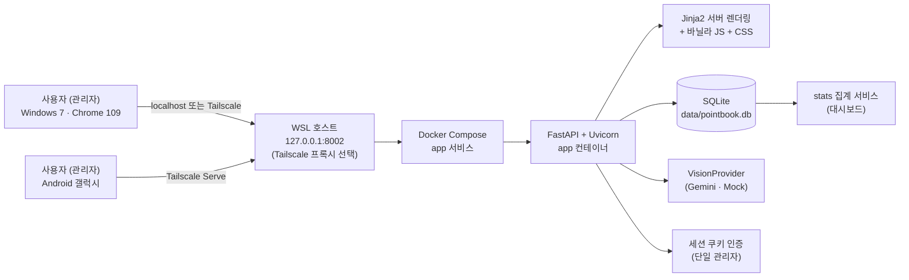
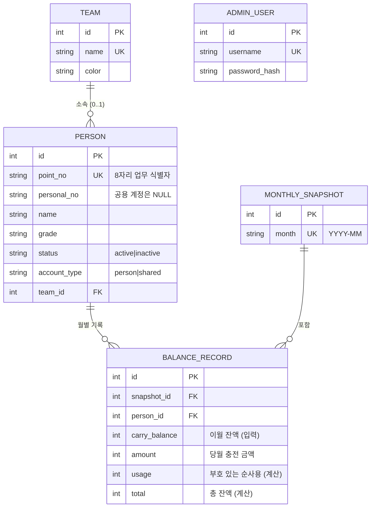
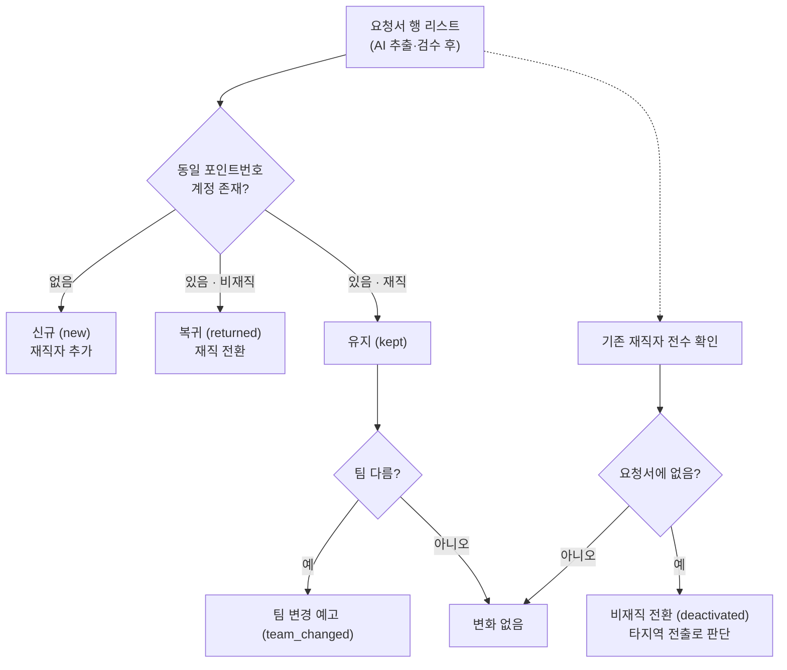
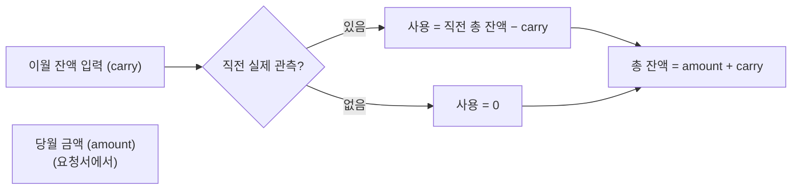
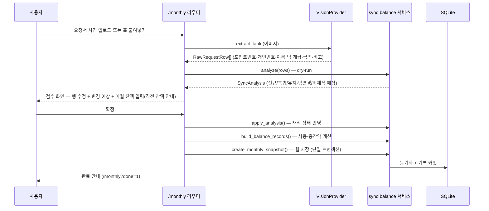
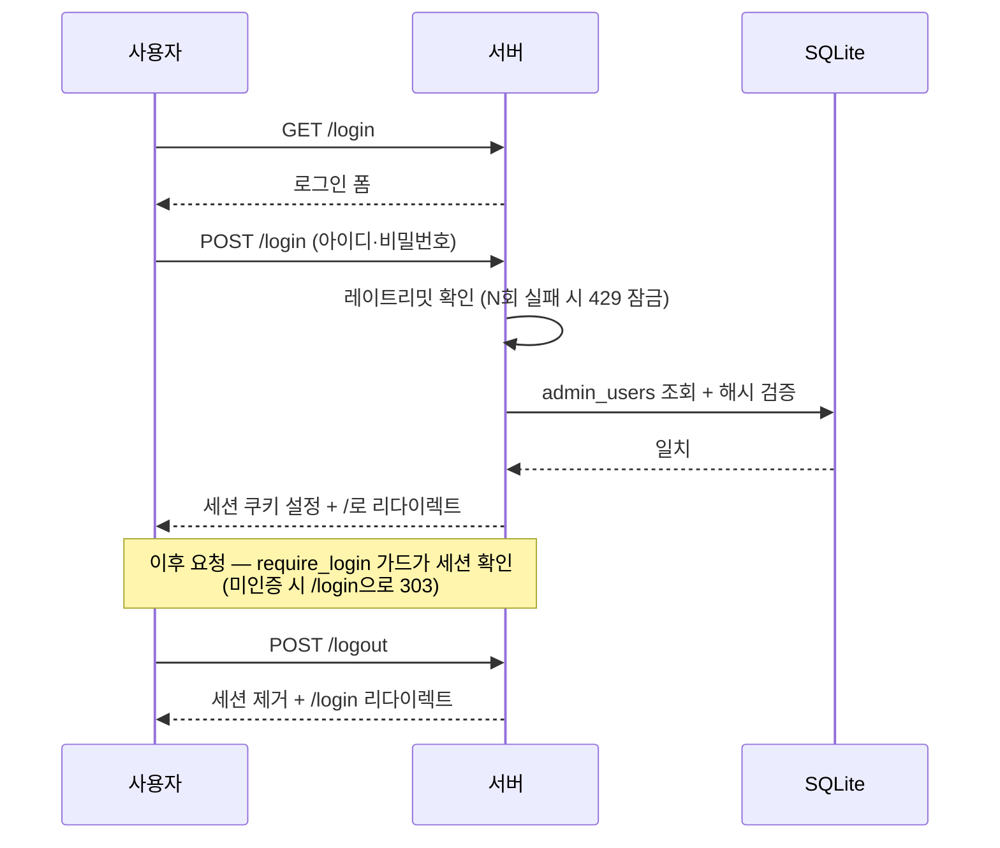
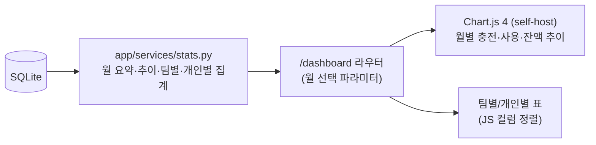
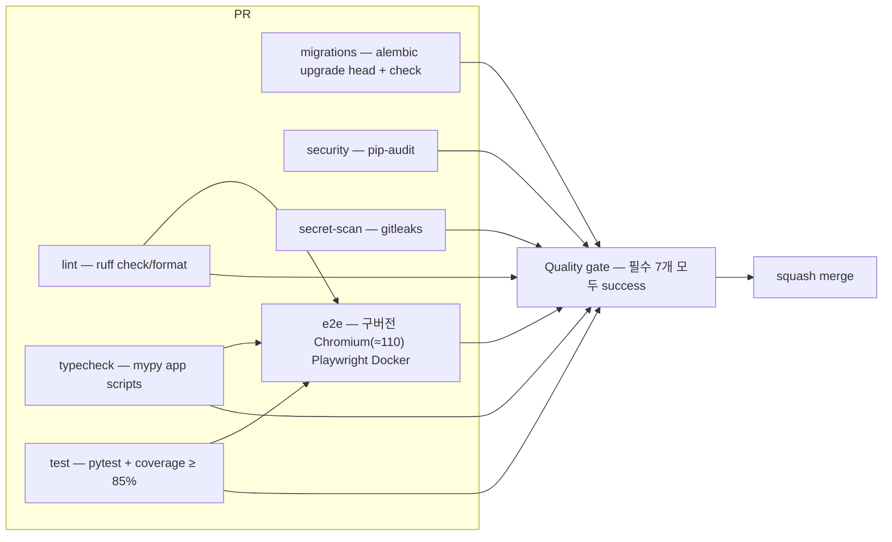

# PointBook 아키텍처

소방서 포인트 충전 요청서(엑셀)를 웹에서 관리하는 서비스의 기술 아키텍처 문서.
코드 구조, 데이터 모델, 핵심 도메인 로직, 주요 흐름을 다이어그램과 함께 설명한다.

## 1. 시스템 개요



- **클라이언트**: 빌드 단계 없는 서버 렌더링 HTML + 바닐라 JS — Win7 Chrome 109·갤럭시를 목표로 검증 (실기 수용은 별도 기록)
- **서버**: FastAPI + Uvicorn 단일 앱 컨테이너, 호스트 UID/GID로 비루트 실행, Docker Compose 자동 재시작 (`scripts/run.sh`)
- **저장소**: 호스트 `data/`를 `/app/data`로 bind mount한 SQLite 단일 파일
- **AI**: `VisionProvider` 인터페이스로 추상화 — Gemini 구현체 제공, 프로바이더 교체는 `AI_PROVIDER` 설정만 변경
- **캐시**: 모든 HTML 응답에 `Cache-Control: no-store` 미들웨어 적용 (스테일 페이지 방지, 정적 파일은 캐시 유지)

## 2. 디렉터리 구조

```
PointBook/
├── Dockerfile              # 운영 앱 이미지 (uv lockfile, 비루트 사용자)
├── docker-compose.yml      # 운영 서버(포트·데이터·health·restart)
├── app/
│   ├── main.py             # FastAPI 앱 생성, 라우터 등록, lifespan(DB 초기화·보안 경고)
│   ├── config.py           # 환경설정 (pydantic-settings, .env) + 보안 경고 검사
│   ├── db.py               # SQLAlchemy 엔진·세션, configure_database, Alembic 마이그레이션 실행
│   ├── models.py           # ORM 모델 5종 (아래 ERD)
│   ├── _version.py         # 버전 단일 소스 (__version__)
│   ├── auth.py             # 세션 인증 — require_login 가드
│   ├── logging.py          # 공통 로거 (시작·보안·확정·백업 이벤트, 민감정보 미기록)
│   ├── template_utils.py   # Jinja2 템플릿 객체 + 금액/포인트번호 표시 필터
│   ├── routers/            # 라우터 (URL → 렌더링/리다이렉트)
│   │   ├── auth.py         #   로그인/로그아웃 (+ 레이트리밋)
│   │   ├── home.py         #   홈 (카드 메뉴)
│   │   ├── people.py       #   인원 목록·현재 프로필 승인·상세
│   │   ├── teams.py        #   팀 마스터 추가/삭제 + 팀 상세(소속 인원)
│   │   ├── monthly.py      #   월간 처리: 업로드(검증) → 검수 → 확정(트랜잭션+백업)
│   │   ├── dashboard.py    #   대시보드 (월 선택)
│   │   └── settings.py     #   설정 — 관리자 비밀번호 변경
│   ├── services/           # 도메인 로직 (라우터에서 호출)
│   │   ├── sync.py         #   ★ 재직 상태 대조 동기화 (analyze/apply)
│   │   ├── balance.py      #   ★ 잔액 계산 (사용 합계·총 잔액·스냅샷)
│   │   ├── stats.py        #   대시보드 집계 (월/팀/개인/추이, eager loading)
│   │   ├── teams.py        #   팀 자동 생성 (get_or_create_team)
│   │   ├── parsing.py      #   붙여넣기 텍스트 파싱
│   │   ├── excel_import.py #   엑셀 이관 (openpyxl)
│   │   ├── ledger_import.py#   누적 장부 파싱·검증·트랜잭션 이관
│   │   ├── identifiers.py  #   8자리 포인트번호 정규화·표시
│   │   ├── dates.py        #   KST 시간대 current_month
│   │   ├── backup.py       #   DB 자동 백업 + 보관 개수 제한
│   │   └── rate_limit.py   #   로그인 브루트포스 방지 (인메모리)
│   ├── ai/                 # 요청서 사진 인식
│   │   ├── base.py         #   VisionProvider 인터페이스
│   │   ├── gemini.py       #   Gemini 구현체 (REST, GEMINI_MODEL)
│   │   ├── mock.py         #   Mock 구현체 (MOCK_TABLE_JSON)
│   │   └── factory.py      #   AI_PROVIDER 설정으로 선택 (mock|gemini)
│   ├── templates/          # Jinja2 템플릿 (base/people/teams/monthly/review/settings/...)
│   └── static/             # css/style.css, js/(dashboard.js, chart.umd.min.js), fonts/
├── migrations/             # Alembic 마이그레이션 (env.py + versions/)
├── alembic.ini             # Alembic 설정 (DB URL은 env.py가 app 설정에서 주입)
├── scripts/
│   ├── init_db.py          # 관리자 계정 생성
│   ├── import_excel.py     # 기존 엑셀 → DB 이관 (빈 DB 전용)
│   ├── import_ledger.py    # 누적 장부 dry-run/apply CLI
│   ├── backup.py           # DB 수동 백업
│   ├── run.sh              # 운영 Compose 빌드·기동·healthy 대기
│   ├── stop.sh             # Compose/소유권 확인 legacy 서버 중지
│   └── deploy.sh           # 이미지 빌드·중지·DB 백업·기동·상태 확인
├── tests/                  # pytest 단위 테스트 (커버리지 85%+)
├── e2e/                    # 구버전 Chromium E2E + 운영 Compose 영속성 스모크
├── docs/                   # 아키텍처·사용 가이드
└── .github/workflows/ci.yml# CI (lint/typecheck/test/migrations/security/secret-scan/e2e)
```

레이어 규칙: `routers → services → models/db`. 라우터는 폼 파싱·렌더링만 담당하고,
도메인 규칙은 반드시 services에 둔다 (테스트 가능성·재사용 보장).

## 3. 데이터 모델 (ERD)



| 테이블 | 설명 |
|---|---|
| `teams` | 팀 마스터. 요청서에서 새 팀이 나오면 자동 생성, 이름·색상 관리 |
| `people` | 일반 인원·공용 계정. **고유값 = `point_no`**. 공용은 `personal_no=NULL`, 항상 active |
| `monthly_snapshots` | 월간 처리 단위. `month`(YYYY-MM) 중복 불가 |
| `balance_records` | 인원×월별 잔액 기록. `(snapshot_id, person_id)` 유일 |
| `admin_users` | 관리자 계정 (werkzeug 해시) |

## 4. 핵심 도메인 로직

### 4-1. 재직 상태 대조 동기화 (`app/services/sync.py`)

요청서는 "이번 달 충전 대상 명단"이므로, **DB의 전체 인원과 대조**해야 한다.



- `analyze(db, rows) → SyncAnalysis`: **DB를 변경하지 않고** 변경 계획만 계산 (검수 화면의 예상 표시용, dry-run)
- `apply_analysis(db, analysis)`: 계획을 실제 반영 (신규 추가·비재직 전환·복귀·팀 변경 — 새 팀은 마스터에 자동 생성)
- 정규화한 포인트번호 중복은 오류로 거부하며, 같은 포인트번호의 이름·개인번호 변경은 기존 계정에 반영한다.
- 공용 계정은 요청서 누락으로 비재직 전환하지 않는다.

### 4-2. 잔액 계산 (`app/services/balance.py`)

매달 요청서 수령 시 **처리 대상 전체 인원**의 이월 잔액을 사용자가 입력한다.

| 항목 | 공식 |
|---|---|
| 순사용 | `가장 최근 이전 기록의 총 잔액 − 이번 달 입력한 이월 잔액` |
| 총 잔액 | `이번 달 들어온 금액 + 이번 달 입력한 이월 잔액` |



- `previous_total()`: 해당 인원의 직전 실제 월간/별도 관측 총 잔액 (비재직자 잔액 보존 확인에도 사용)
- `create_monthly_snapshot()`: 월 스냅샷 + 인원별 기록을 **단일 트랜잭션**으로 저장, 중복 월 거부
- `recompute_record()`: 개별 수정 후 사용 합계·총 잔액 재계산
- 순사용이 양수면 포인트 순감소, 음수면 관측 사이 순증가이며 원인을 추정하지 않고 그대로 보존한다.

## 5. 주요 흐름

### 5-1. 월간 처리 (핵심 사용 흐름)



- 업로드 실패(인식된 인원 없음) 시 오류 안내 후 재시도
- 확정된 월의 새 일반 확정은 차단하며 변경은 전용 정정 승인으로 처리한다.
- 확정 커밋 전 `backup_database()`가 직전 상태를 `data/backups/`에 자동 백업 (보관 개수 제한)
- 동기화·잔액 계산·스냅샷 저장은 단일 트랜잭션이며, 실패 시 롤백 후 친절한 오류 페이지 표시

### 5-2. 기본 정보·장부 정정의 승인

현재 프로필은 `profiles.py`, 과거 정정·현재 관측은 `ledger.py`의 서명된 `LedgerPlan`으로
검토한다. `BEGIN IMMEDIATE` 안에서 기준과 payload를 재계산해 승인 토큰·장부 버전을
확인한다. 첫 DML 전에 백업하고 변경과 `LedgerOperation`을 같은 트랜잭션으로 반영한다.
같은 작업 키·payload는 같은 결과를 반환하며 다른 payload 또는 오래된 버전은 409다.

`BalanceRecord.profile_data/note/provenance/observed_at`에 당시 정보를 고정하고
`BalanceRevision`에 원본과 정정판을 보존한다. `BalanceAdjustment`는 현재 확인 잔액의
별도 관측이며 월간 충전과 구분한다. 감사·revision·보정 테이블은 UPDATE/DELETE trigger로
변경을 거부한다. 기존 기록은 `master_at_migration` 출처와 시각 NULL을 사용하며 원래
작성자·시각을 만들지 않는다.

과거 total 정정은 다음 실제 월간 기록의 usage에만 영향을 주며 중간 명시적 보정 관측을
존중한다. 이후 입력 carry/amount는 유지하고 현재값은 최신 유효 관측에 맞춘다.
읽기 전용 `integrity.py` 검사는 계산식·관측 연결·현재값·FK·월/당시 정보 형식을 검사한다.
계산 복구는 오류를 포함한 일관된 사전 사본을 별도 보존하고 승인 계획·재검사·감사를 남긴다.

### 5-3. 인증



- 세션 쿠키는 `SameSite=lax` 기본, HTTPS 전환 시 `COOKIE_SECURE=true`로 Secure 플래그
- 로그인 실패는 사용자+IP 기준 인메모리 카운터로 제한 (성공 시 초기화)

## 6. 대시보드 데이터 흐름



- 집계와 표현 분리: `stats.py`가 순수 데이터만 반환, 템플릿은 표시 담당
- 새 통계 추가 시 `stats.py`에 함수만 추가하면 됨 (변경 용이 설계)

## 7. 테스트·CI 전략



- 단위 테스트: 도메인 로직(sync/balance) 중심 + 라우터 폼 흐름 (TestClient)
- E2E: 구버전 Chromium으로 핵심 사용 흐름 자동 검증. Win7 Chrome 109·Android 실기 수용과 구분한다.
- 필수 7개 job의 실패·취소·건너뜀은 품질 게이트 실패로 처리한다.
- CI는 PR 머지 ref(`refs/pull/N/merge`) 기준 실행한다. 공용 테스트 파일은 필요한 부분만 수정하고,
  main 갱신·충돌 해결의 영향을 검증한다 ([개발 안내](agent-workflow.md) 참고).

## 8. 마이그레이션·백업 전략

- **마이그레이션**: Alembic이 관리하며 서버 기동 시 적용한다. 무버전 DB는 알려진
  전체 schema signature로 과거 revision을 판별한다. 알 수 없는 구조는 보존하고 중단한다.
  신규 연결은 foreign_keys를 활성화하며 엔진 교체·lifespan 종료 시 연결을 해제한다.
- **백업**: SQLite backup API로 WAL을 포함한 일관된 사본을 취득하고 무결성·외래키·
  구조·장부 합계·SHA-256 metadata를 검증한다. 같은 DB 소유권 UUID의 검증 사본만 정리한다.
- **복원·배포**: immutable 이미지 ID와 canonical mount를 고정한다. 사전 rehearsal,
  기존 DB 보존, 기동·DB readiness·재시작 영속성 대사를 수행한다. 쓰기 재개 뒤 자동
  DB rollback은 하지 않는다. 상세 명령과 실패 경계는 [운영 절차](backup-restore.md)를 따른다.

### 누적 장부 이관

`ledger_import.py`는 2024-05~2026-08의 고정 열 매핑과 상세행만 읽고 원본 집계행은
사용하지 않는다. dry-run과 apply가 같은 파서·불변식 검증을 사용하며 출력에는 건수,
월, 금액, 오류 셀 좌표만 남긴다. apply는 백업 성공 후 계정·28개 스냅샷·잔액 기록을
한 트랜잭션으로 저장하고 사후 합계를 다시 검사한 뒤에만 commit한다.
`--replace-empty-history-people`는 스냅샷·잔액 기록이 없고 전체 기존 계정이 미매칭
테스트 계정 정확히 2개일 때만 삭제 계획을 생성한다.

### 인증과 AI 실행 경계

모든 POST에 CSRF를 적용하고 DB의 관리자 auth_version으로 세션을 검사한다. 암호 변경은
기존 세션을 폐기한다. 전달 IP는 명시한 프록시만 신뢰한다. `/health`는 DB revision과 구조를 검사한다.

AI 호출은 제한된 thread executor에서 실행한다. timeout 뒤에도 실행 중인 worker는 슬롯을
계속 점유해 반복 요청으로 한도를 우회하지 못한다. 이미지 형식·크기와 전체 JSON 응답을
검증하고 불완전 행의 원문·행 위치를 검수로 전달한다. Gemini 키는 header로 보내며 외부
오류 원문 대신 고정 메시지와 참조 ID를 제공한다. 원본 사진은 영구 저장하지 않는다.

### 장부 조회와 보고서 계약

`observations.py`는 UNION/window 조회로 월간 기록과 별도 관측의 마지막 값을 일괄 선택한다.
`stats.Report`는 월간 활동과 observed/as_of 잔액, 기록의 유형·월별 재직 상태와 미확인 잔액을 구분한다. 이름·번호·팀·계급은 현재 인원 마스터를 사용한다.
요청에서 잡은 operation cutoff를 월별 보고서와 추이에 공유하고 revision을 읽어 동시 정정의
전후가 섞이지 않게 한다. HTML·향후 XLSX 출력은 이 DTO를 사용한다. 합계는 Python 정수로
계산한다. 충전 입력은 MAX_MONEY, 이월/현재/계산 총액은 MAX_TOTAL까지 허용한다.

`d14a06000001` 이전은 기존 모든 금액·현재값을 보존하며 baseline revision만 추가한다.
감사 원장을 삭제하는 downgrade는 제공하지 않는다. 이전 앱으로 돌아갈 때에는 호환 이미지와
검증된 이전 DB 사본으로 복원해야 하며 쓰기 재개 이후 데이터 보존 절차는 운영 문서를 따른다.


### 서버 초안·표준 XLSX

`MonthlyDraft`는 관리자 소유권·안정 행 ID·원문·출처·검수 상태·기준 버전·보관 기한을 가진다.
저장과 원장 확정은 분리한다. save는 쓰기 잠금과 버전 확인 뒤 초안만 갱신하며 월간 확정은
같은 원장 트랜잭션 안에서 초안을 confirmed로 전환한다. 종료된 원장 기록을 초안 삭제로 지우지 않는다.
만료 자료는 접근을 거부하고 기동 시·한 시간마다 원문을 정리한다. 종료 시 정리 worker가
끝나기 전에 DB 엔진을 버리지 않는다.

브라우저는 한글 조합 종료 후 debounce하고 저장을 하나씩 순서대로 수행한다. 실패/충돌은
자동 재시도를 멈추고 원래 DOM을 보존한다. 재로그인은 별도 탭에서 수행하고 CSRF를 다시 받아
저장한다. 원문은 localStorage에 넣지 않는다. 검수 화면의 canonical GET URL로 새로고침한다.

`xlsx.py`는 표준 양식 버전·셀 위치를 검증하고 공통 RawRequestRow→검수·초안으로 전달한다.
ZIP/XML 크기·항목·행/열·시간, defusedxml, 외부 관계·매크로 차단과 실행 슬롯 2개를 적용한다.
입력/보고서는 다른 양식이며 수식은 평가하지 않는다. 출력은 Report의 조회 범위·정정판·정렬을
공유하고 텍스트 셀 타입을 명시한다. 16자리 이상 정수 합계는 Excel 정밀도 손실을 피하려 문자열로 보존한다.
상세 한도·오류 계약은 [Excel 안내](excel-workflow.md), 전체 수용 근거는 [v1.4.0 수용 기록](v1.4.0-acceptance.md)에 있다.


### 기존 월별 장부와 인원 정보 (실기 피드백 반영)

기존 Excel 출처(`master_at_migration`, `legacy_import`)의 일반 인원 상태는 해당 월 지급액으로
읽는다(0원 비재직 / 지급액 있음 재직). 원본 금액·불변 정정판 JSON을 덮어쓰지 않고, 선택한
정정판의 지급액에 같은 규칙을 적용한다. 신규 이관도 이 규칙으로 상태를 보존한다. 공용계정은
항상 active이고, 웹에서 명시적으로 확인한 상태는 해당 기록을 따른다.

Report는 이름·포인트번호·개인번호·팀·계급을 현재 Person/Team으로 통일한 후 필터·그룹·Excel을
만든다. 월별 별도 인원 정보 정정은 제공하지 않는다. 기존 원본/감사 데이터는 보존하되 일반
조회 표에 복제된 인원 정보·정정판·출처를 노출하지 않는다. 개인 월별표는 기존 5열을 유지한다.
월간 재직/비재직 전환 수는 월간 기록 건수와 별도이며 선택한 정정판의 직전 실제 월간 기록과
상태를 비교한다. 미관측 달·잔액 보정·기존 비재직·공용을 신규 비재직 전환으로 세지 않는다.
