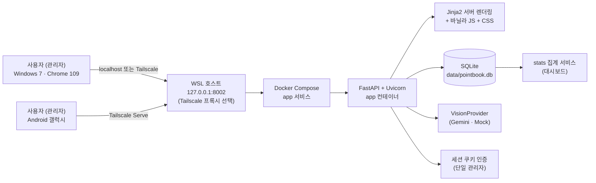
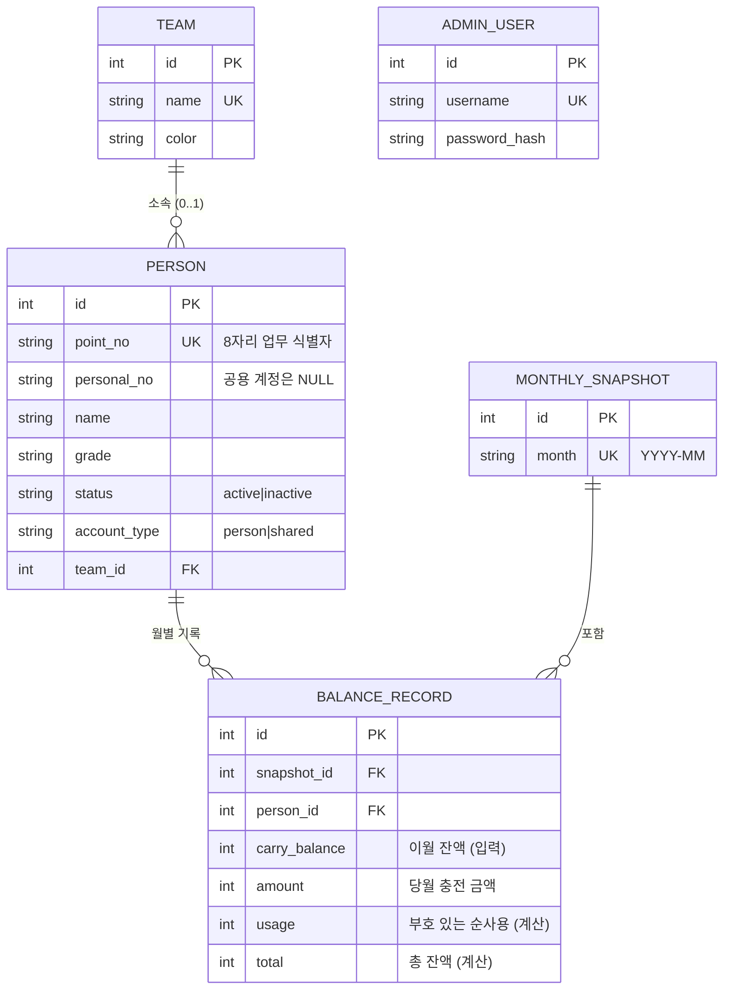
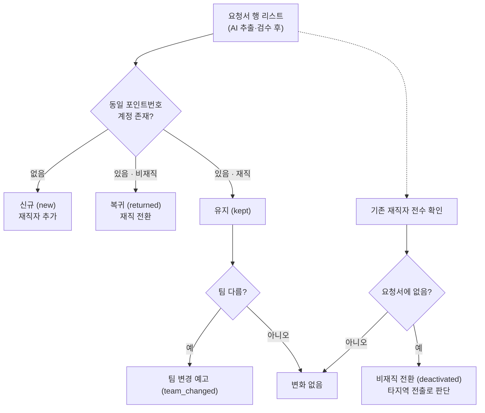
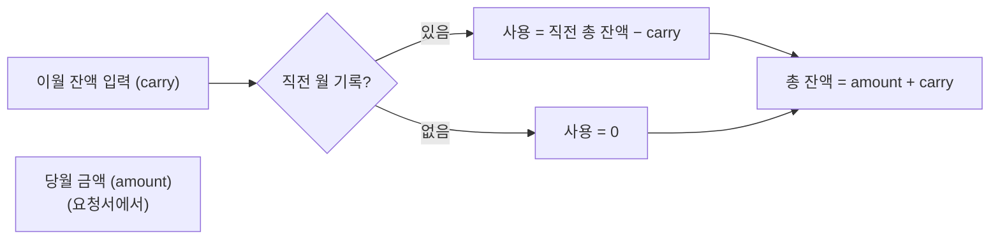
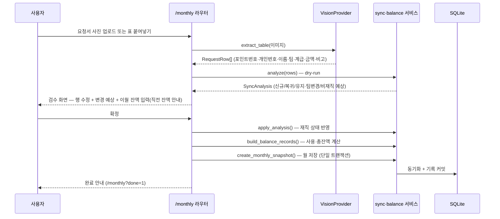
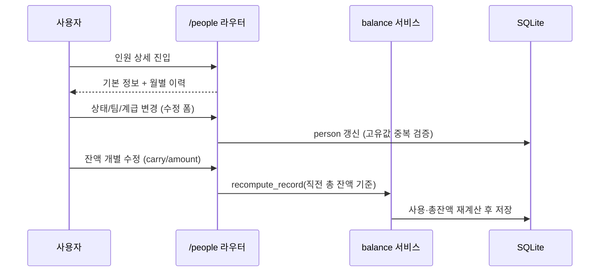
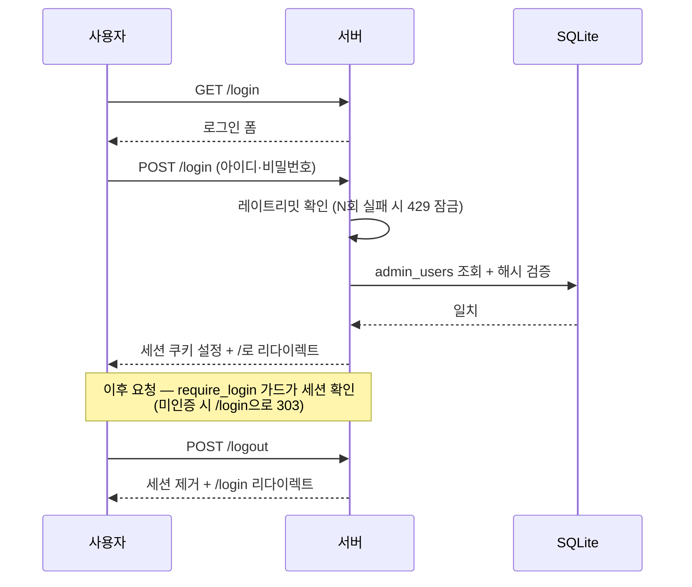
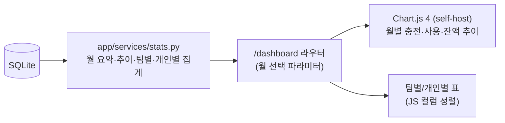
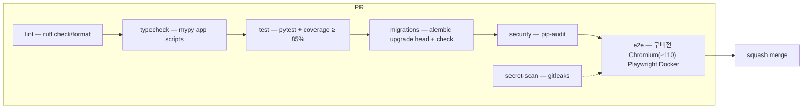

# PointBook 아키텍처

소방서 포인트 충전 요청서(엑셀)를 웹에서 관리하는 서비스의 기술 아키텍처 문서.
코드 구조, 데이터 모델, 핵심 도메인 로직, 주요 흐름을 다이어그램과 함께 설명한다.

## 1. 시스템 개요



- **클라이언트**: 빌드 단계 없는 서버 렌더링 HTML + 바닐라 JS — Win7 Chrome 109·갤럭시 호환
- **서버**: FastAPI + Uvicorn 단일 앱 컨테이너, 호스트 UID/GID로 비루트 실행, Docker Compose 자동 재시작 (`scripts/run.sh`)
- **저장소**: 호스트 `data/`를 `/app/data`로 bind mount한 SQLite 단일 파일
- **AI**: `VisionProvider` 인터페이스로 추상화 — Gemini 구현체 제공, 프로바이더 교체는 `AI_PROVIDER` 설정만 변경
- **캐시**: 모든 HTML 응답에 `Cache-Control: no-store` 미들웨어 적용 (스테일 페이지 방지, 정적 파일은 캐시 유지)

## 2. 디렉터리 구조

```
PointBook/
├── Dockerfile              # 운영 앱 이미지 (uv lockfile, 비루트 사용자)
├── docker-compose.yml      # 운영 서버(포트·데이터·health·restart)
├── app/
│   ├── main.py             # FastAPI 앱 생성, 라우터 등록, lifespan(DB 초기화·보안 경고)
│   ├── config.py           # 환경설정 (pydantic-settings, .env) + 보안 경고 검사
│   ├── db.py               # SQLAlchemy 엔진·세션, configure_database, Alembic 마이그레이션 실행
│   ├── models.py           # ORM 모델 5종 (아래 ERD)
│   ├── _version.py         # 버전 단일 소스 (__version__)
│   ├── auth.py             # 세션 인증 — require_login 가드
│   ├── logging.py          # 공통 로거 (시작·보안·확정·백업 이벤트, 민감정보 미기록)
│   ├── template_utils.py   # Jinja2 템플릿 객체 + 금액/포인트번호 표시 필터
│   ├── routers/            # 라우터 (URL → 렌더링/리다이렉트)
│   │   ├── auth.py         #   로그인/로그아웃 (+ 레이트리밋)
│   │   ├── home.py         #   홈 (카드 메뉴)
│   │   ├── people.py       #   인원 목록(페이지네이션)·추가·수정·상세·개별 잔액 수정
│   │   ├── teams.py        #   팀 마스터 추가/삭제 + 팀 상세(소속 인원)
│   │   ├── monthly.py      #   월간 처리: 업로드(검증) → 검수 → 확정(트랜잭션+백업)
│   │   ├── dashboard.py    #   대시보드 (월 선택)
│   │   └── settings.py     #   설정 — 관리자 비밀번호 변경
│   ├── services/           # 도메인 로직 (라우터에서 호출)
│   │   ├── sync.py         #   ★ 재직 상태 대조 동기화 (analyze/apply)
│   │   ├── balance.py      #   ★ 잔액 계산 (사용 합계·총 잔액·스냅샷)
│   │   ├── stats.py        #   대시보드 집계 (월/팀/개인/추이, eager loading)
│   │   ├── teams.py        #   팀 자동 생성 (get_or_create_team)
│   │   ├── parsing.py      #   붙여넣기 텍스트 파싱
│   │   ├── excel_import.py #   엑셀 이관 (openpyxl)
│   │   ├── ledger_import.py#   누적 장부 파싱·검증·트랜잭션 이관
│   │   ├── identifiers.py  #   8자리 포인트번호 정규화·표시
│   │   ├── dates.py        #   KST 시간대 current_month
│   │   ├── backup.py       #   DB 자동 백업 + 보관 개수 제한
│   │   └── rate_limit.py   #   로그인 브루트포스 방지 (인메모리)
│   ├── ai/                 # 요청서 사진 인식
│   │   ├── base.py         #   VisionProvider 인터페이스
│   │   ├── gemini.py       #   Gemini 구현체 (REST, GEMINI_MODEL)
│   │   ├── mock.py         #   Mock 구현체 (MOCK_TABLE_JSON)
│   │   └── factory.py      #   AI_PROVIDER 설정으로 선택 (mock|gemini)
│   ├── templates/          # Jinja2 템플릿 (base/people/teams/monthly/review/settings/...)
│   └── static/             # css/style.css, js/(dashboard.js, chart.umd.min.js), fonts/
├── migrations/             # Alembic 마이그레이션 (env.py + versions/)
├── alembic.ini             # Alembic 설정 (DB URL은 env.py가 app 설정에서 주입)
├── scripts/
│   ├── init_db.py          # 관리자 계정 생성
│   ├── import_excel.py     # 기존 엑셀 → DB 이관 (빈 DB 전용)
│   ├── import_ledger.py    # 누적 장부 dry-run/apply CLI
│   ├── backup.py           # DB 수동 백업
│   ├── run.sh              # 운영 Compose 빌드·기동·healthy 대기
│   ├── stop.sh             # Compose/소유권 확인 legacy 서버 중지
│   └── deploy.sh           # 이미지 빌드·중지·DB 백업·기동·상태 확인
├── tests/                  # pytest 단위 테스트 (커버리지 85%+)
├── e2e/                    # 구버전 Chromium E2E + 운영 Compose 영속성 스모크
├── docs/                   # 아키텍처·사용 가이드
└── .github/workflows/ci.yml# CI (lint/typecheck/test/migrations/security/secret-scan/e2e)
```

레이어 규칙: `routers → services → models/db`. 라우터는 폼 파싱·렌더링만 담당하고,
도메인 규칙은 반드시 services에 둔다 (테스트 가능성·재사용 보장).

## 3. 데이터 모델 (ERD)



| 테이블 | 설명 |
|---|---|
| `teams` | 팀 마스터. 요청서에서 새 팀이 나오면 자동 생성, 이름·색상 관리 |
| `people` | 일반 인원·공용 계정. **고유값 = `point_no`**. 공용은 `personal_no=NULL`, 항상 active |
| `monthly_snapshots` | 월간 처리 단위. `month`(YYYY-MM) 중복 불가 |
| `balance_records` | 인원×월별 잔액 기록. `(snapshot_id, person_id)` 유일 |
| `admin_users` | 관리자 계정 (werkzeug 해시) |

## 4. 핵심 도메인 로직

### 4-1. 재직 상태 대조 동기화 (`app/services/sync.py`)

요청서는 "이번 달 충전 대상 명단"이므로, **DB의 전체 인원과 대조**해야 한다.



- `analyze(db, rows) → SyncAnalysis`: **DB를 변경하지 않고** 변경 계획만 계산 (검수 화면의 예상 표시용, dry-run)
- `apply_analysis(db, analysis)`: 계획을 실제 반영 (신규 추가·비재직 전환·복귀·팀 변경 — 새 팀은 마스터에 자동 생성)
- 정규화한 포인트번호 중복은 오류로 거부하며, 같은 포인트번호의 이름·개인번호 변경은 기존 계정에 반영한다.
- 공용 계정은 요청서 누락으로 비재직 전환하지 않는다.

### 4-2. 잔액 계산 (`app/services/balance.py`)

매달 요청서 수령 시 **처리 대상 전체 인원**의 이월 잔액을 사용자가 입력한다.

| 항목 | 공식 |
|---|---|
| 순사용 | `가장 최근 이전 기록의 총 잔액 − 이번 달 입력한 이월 잔액` |
| 총 잔액 | `이번 달 들어온 금액 + 이번 달 입력한 이월 잔액` |



- `previous_total()`: 해당 인원의 직전 월 기록의 총 잔액 (비재직자 잔액 보존 확인에도 사용)
- `create_monthly_snapshot()`: 월 스냅샷 + 인원별 기록을 **단일 트랜잭션**으로 저장, 중복 월 거부
- `recompute_record()`: 개별 수정 후 사용 합계·총 잔액 재계산
- 순사용이 양수면 포인트 순감소, 음수면 적립·이전 등에 따른 순증가이며 음수를 그대로 보존한다.

## 5. 주요 흐름

### 5-1. 월간 처리 (핵심 사용 흐름)



- 업로드 실패(인식된 인원 없음) 시 오류 안내 후 재시도
- 확정 후 해당 월은 재처리 불가 — 변경은 개별 수정으로만
- 확정 커밋 전 `backup_database()`가 직전 상태를 `data/backups/`에 자동 백업 (보관 개수 제한)
- 동기화·잔액 계산·스냅샷 저장은 단일 트랜잭션이며, 실패 시 롤백 후 친절한 오류 페이지 표시

### 5-2. 개별 인원 수정



- 요청서와 무관한 개인 변동(한 명만 잔액 변경 등)에 사용
- 비재직 처리된 인원의 잔액은 보존 — 복귀 시 이어서 계산

### 5-3. 인증



- 세션 쿠키는 `SameSite=lax` 기본, HTTPS 전환 시 `COOKIE_SECURE=true`로 Secure 플래그
- 로그인 실패는 사용자+IP 기준 인메모리 카운터로 제한 (성공 시 초기화)

## 6. 대시보드 데이터 흐름



- 집계와 표현 분리: `stats.py`가 순수 데이터만 반환, 템플릿은 표시 담당
- 새 통계 추가 시 `stats.py`에 함수만 추가하면 됨 (변경 용이 설계)

## 7. 테스트·CI 전략



- 단위 테스트: 도메인 로직(sync/balance) 중심 + 라우터 폼 흐름 (TestClient)
- E2E: Win7 마지막 Chrome(109)과 같은 Blink 세대의 구버전 Chromium으로 핵심 사용 흐름 검증
- 주의: CI는 PR 머지 ref(`refs/pull/N/merge`) 기준 실행 — 공용 테스트 파일은 main과 동일하게 유지 (AGENTS.md 참고)

## 8. 마이그레이션·백업 전략

- **마이그레이션**: Alembic이 스키마 변경을 관리. 서버 기동 시 `init_db()`가 `upgrade head`를
  실행하고, 기존 1.0.x DB는 `alembic_version` 부재 시 현재 스키마를 head로 자동 표식(stamp)한다.
  `migrations/env.py`가 `app` 설정의 DB URL을 주입하므로 테스트·개발·운영이 같은 대상을 쓴다.
- **백업**: SQLite 단일 파일 특성상 파일 복사가 곧 백업. 월간 확정 커밋 전에
  `data/backups/pointbook-<타임스탬프>.db`를 생성하고 `BACKUP_KEEP`(기본 30)개만 유지한다.
  호스트 `data/`가 bind mount되므로 컨테이너 교체 뒤에도 DB와 백업이 유지된다. 수동 백업은
  `scripts/backup.py`로 가능하며, 복구는 Compose 서버 중지 후 파일 복사로 끝난다.
- **배포 백업**: `scripts/deploy.sh`는 새 이미지를 먼저 빌드하고 PointBook 컨테이너 또는
  소유권이 확인된 legacy Uvicorn의 종료를 확인한 뒤 DB를 복사한다. 종료 실패 시 배포를
  중단하며, 새 컨테이너의 healthcheck와 호스트 `/login` 응답이 모두 성공해야 완료된다.

### 누적 장부 이관

`ledger_import.py`는 2024-05~2026-08의 고정 열 매핑과 상세행만 읽고 원본 집계행은
사용하지 않는다. dry-run과 apply가 같은 파서·불변식 검증을 사용하며 출력에는 건수,
월, 금액, 오류 셀 좌표만 남긴다. apply는 백업 성공 후 계정·28개 스냅샷·잔액 기록을
한 트랜잭션으로 저장하고 사후 합계를 다시 검사한 뒤에만 commit한다.
`--replace-empty-history-people`는 스냅샷·잔액 기록이 없고 전체 기존 계정이 미매칭
테스트 계정 정확히 2개일 때만 삭제 계획을 생성한다.
